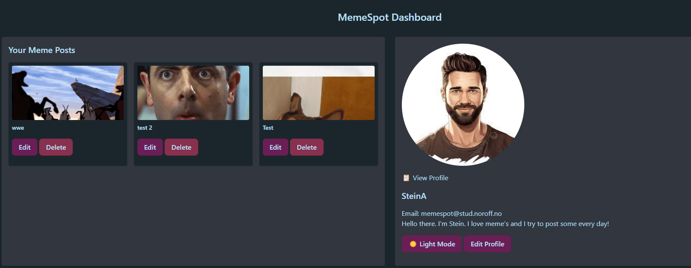
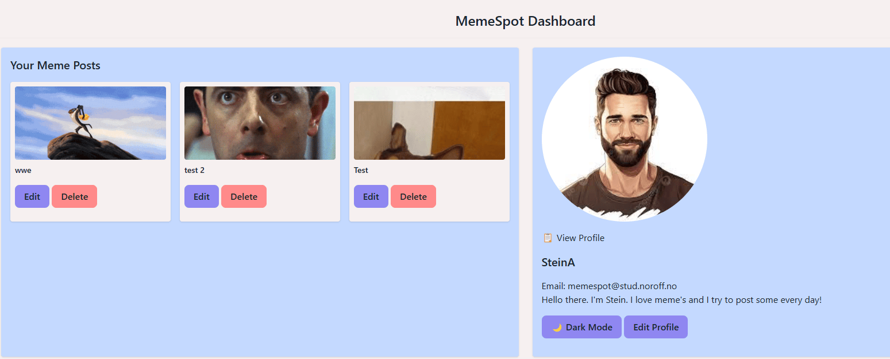

# MemeSpot - A Social Media Platform for Memes.

MemeSpot is a social media platform where users can create an account to share fun memes. Users can follow each other, explore profiles, and interact
with memes in a fun and engaging way.




## Features

- User Authentication: Sign up and log in to access the platform.
- Create and Manage Posts: Users can create, edit and delete their own memes.
- User Profiles: Each user has a dedicated profile page displaying their posts and profile information.
- Follow System: Users can follow and unfollow others to keep up with their posts.
- Dashboard: A personal space where users can view their posts and manage their profile.
- Post Viewing: Click on a meme to view its full post page.
- Tailwind CSS for Styling: The project uses Tailwind CSS via CDN, so no setup is required for styling.

## Used For

This project has been used for JavaScript 2 and CSS Frameworks assignment at Noroff Vocational School.

## Tech Stack

- JavaScript (Vanilla JS) - Core functionality and API interaction.

- Tailwind CSS (via CDN) - For easy and responsive styling.

- Noroff Social API - Handles authentication, posts, and user data.

- Noroff Profile API - Handles user profiles, follow/unfollow.

## Setup & Usage

### Clone the repository

> [!TIP]
> git clone https://github.com/NoroffFEU/js2-course-assignment-Arkuradev
>
> cd js2-course-assignment-Arkuradev

### Install Dependencies

Install Node.js, if you don't have it, download it from [nodejs.org](https://nodejs.org).

Install Tailwind and its dependencies:

```
npm install
```

### Run Tailwind in watch mode

Use this command when working on the project.

```
npm run dev
```

### Build for production

Optimize CSS for production:

```
npm run build
```

### Demo Users

> [!NOTE]
> If you want to log in straight away you can use one of the users here or create a new account.

1.  Demo user:

- Log in: memespotdemo1@stud.noroff.no
- Password: memespotdemo

### Open in browser

Just open the index.html file in your preferred browser, and you're good to go!

## API Integration

The project interacts with the **Noroff Social API**, handling user authentication, post creation and profile management.

- **Authentication:** Secure login and registration with API key authentication.
- **Posts:** Fetching, creating, editing and deleting meme posts.
- **Profiles:** Fetching user profiles and managing follow/unfollow actions.

## Future Enhancements

- **Comments & Reactions:** Users can comment and react to memes.
- **Additional Themes Support:** Toggle between between different colored themes.
- **Better Search Functionality:** Find memes and users more easily.

## Changes added

- **Light/Dark Mode Support:** Toggle between light and dark theme.

## Author

**Stein Arild Gansmoe** - Built as a part of a project assignment at Noroff Vocational School.
